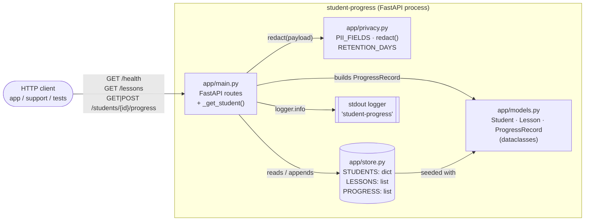
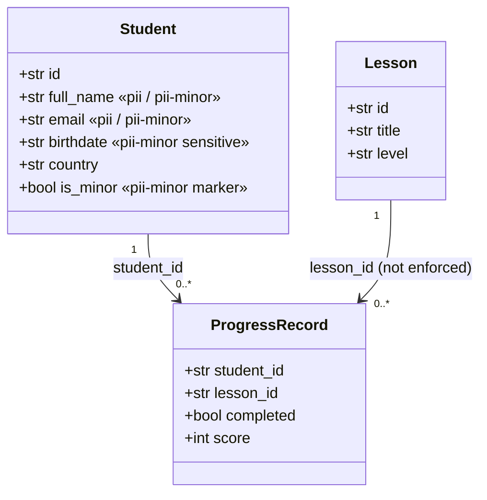
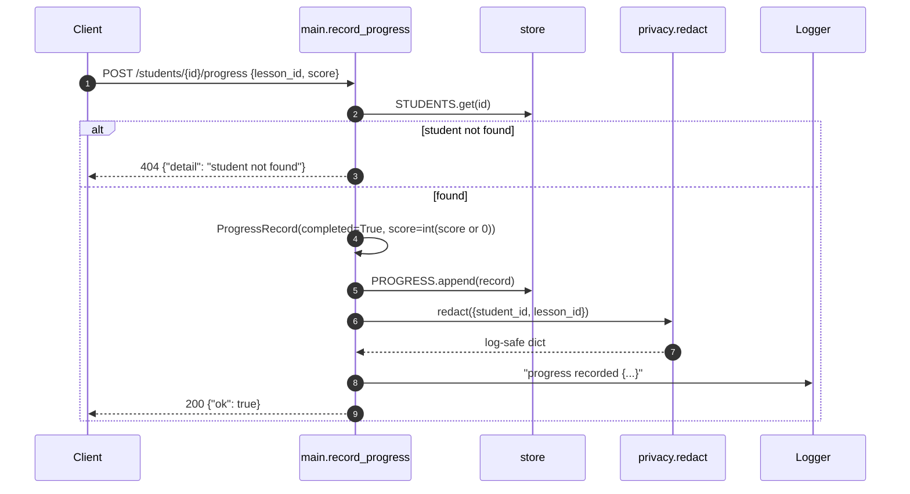
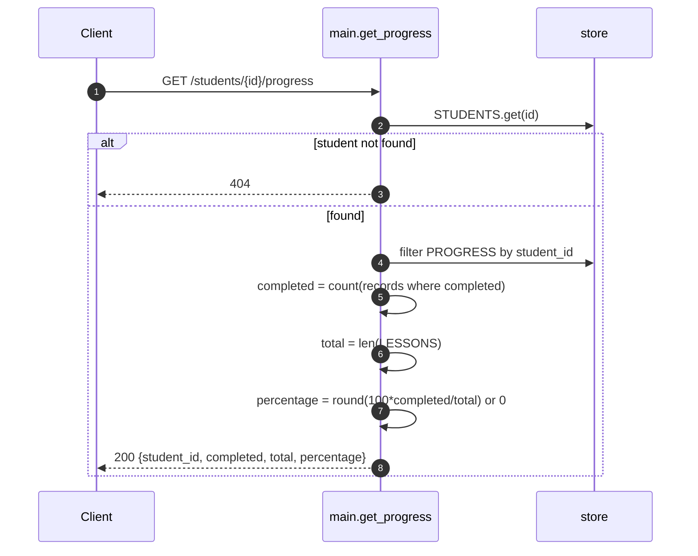
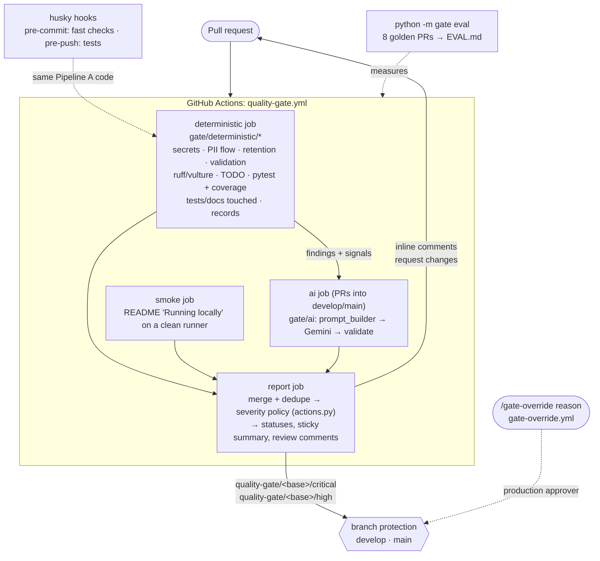

# Architecture — student-progress

A small FastAPI service that tracks students' lesson progress for the Open English LMS.
All state lives in memory; there is no database, queue or external integration.
The repository also contains the **quality gate** that reviews every PR (see [Quality gate](#quality-gate)).

For endpoint contracts and business rules, see [API-AND-BUSINESS-RULES.md](API-AND-BUSINESS-RULES.md). Team rules live in [AGENTS.md](../AGENTS.md).

## Component diagram

## Module responsibilities

| Module | Responsibility |
|--------|----------------|
| `app/main.py` | FastAPI app, route handlers, 404 lookup helper `_get_student`, logger setup. |
| `app/models.py` | Domain dataclasses. Documents PII classification of `Student` fields. |
| `app/store.py` | In-memory seed data: 4 students (2 minors), 5 lessons (A1–B1), 6 progress records. Module-level mutable globals. |
| `app/privacy.py` | `PII_FIELDS` (`full_name`, `email`, `birthdate`, `is_minor`), `redact()` for log-safe payloads, `RETENTION_DAYS` registry per data category. |
| `tests/test_progress.py`, `tests/test_privacy.py` | Endpoint tests via `fastapi.testclient.TestClient`; `redact()` coverage of every personal field. |
| `gate/`, `tests/gate/`, `eval/` | The quality gate, its tests and its golden-set evaluation (below). |
| `AGENTS.md` / `TEAM-STANDARDS.md` | Team rules for agents and reviewers (`AGENTS.md` is the maintained summary). |
| `open_prs.sh` / `PULL_REQUESTS.md` | Tooling and catalog for the 8 open PRs under review. |

## Domain model

## Request flow — recording progress

## Request flow — reading progress

## Runtime & tooling

- Python 3.11+, FastAPI 0.115, served with `uvicorn app.main:app`.
- Tests: `pytest` (`pythonpath = ["."]`, `testpaths = ["tests"]` in `pyproject.toml`).
- Lint: `ruff` (repo config in `pyproject.toml`; the gate applies its own `gate/config/ruff.toml`).
- Git hooks: husky (`package.json`, `.husky/`), calling `gate/hooks/run.sh`.
- Logging: stdlib `logging` at `INFO` to stdout, format `%(name)s %(levelname)s %(message)s`.

## Architectural constraints and caveats

- **Process-local state.** `store` globals are shared across all requests and all tests in a run; restarting the process resets data. Not safe for multiple workers.
- **No persistence layer.** `RETENTION_DAYS` is a declarative registry only — nothing purges data.
- **Single trust boundary.** No authentication/authorization; any caller can read or write any student's progress.
- **PII stays in-process.** `Student` PII is never returned by any endpoint and logs go through `redact()` (see [AGENTS.md](../AGENTS.md)).

## Quality gate

Reviews every pull request against [AGENTS.md](../AGENTS.md) in two pipelines and turns findings into PR actions by severity. Design: [plans/quality-gate-classification.md](../plans/quality-gate-classification.md); trade-offs: [DECISIONS.md](../DECISIONS.md).

| Module | Responsibility |
|--------|----------------|
| `gate/__main__.py`, `gate/local.py` | CLI: `all` (developer one-shot: pre-commit, lint, tests, both pipelines, one verdict), `lint`, `check`, `precommit`, `prepush`, `deterministic`, `smoke`, `ai`, `report`, `override`, `eval`. Wrappers: `scripts/check-all.sh`, `scripts/check-all.ps1`. |
| `gate/env.py` | Loads the developer's local `.env` (gitignored; template `.env.example`) at CLI and pytest start-up; real environment variables (CI secrets) win. |
| `gate/diff.py` | Changed files and lines from a git range, the index (hooks) or a fixture directory. |
| `gate/deterministic/` | Pipeline A, one module per rule family (incl. `vendor_channel.py`: scaffolding for third-party channels with personal data, and `prompt_injection.py`); `runner.py` turns a crashing check into a blocking gate error. |
| `gate/ai/` | Pipeline B: Gemini client with model fallback and output cap (`client.py`), prompts per rule (`prompts/`), structured output validation (`validate.py`), cost with prompt-cache pricing (`pricing.py`), result cache keyed by request hash (`review.py`). Details and cost strategy: [PIPELINES.md](PIPELINES.md). |
| `gate/report/` | Finding schema, tool adapters (`rule_map.yml`), severity → action policy (`actions.py`), pre-existing debt (`baseline.py`: a High code-quality finding on a line the PR only moved becomes Medium; privacy, secrets and tests are never demoted), GitHub publishing, override, per-run cost: AI + CI minutes (`cost.py`). |
| `gate/eval/` | Runs the gate on each golden PR in a temporary worktree and scores it against `eval/ground_truth.yaml`: the merge verdict per PR (every finding counts, process rules included), then precision/recall on AGENTS#1-9. |

Trust boundaries:
- The gate code, prompts and lint config come from the **base branch** checkout, so a PR cannot change the rules it is judged by (except the bootstrap PR that introduces the gate).
- The deterministic job runs the PR's tests but never sees the Gemini key; the AI job holds the key but never executes PR code.
- PR text and code are passed to Gemini as untrusted data; the system prompt forbids following instructions inside them, and a script (A17, `prompt_injection.py`) flags text aimed at the reviewer as High.
- Secrets are masked (`secrets_scan.mask_secrets`) in every file and in the PR text before the request leaves for Gemini.
