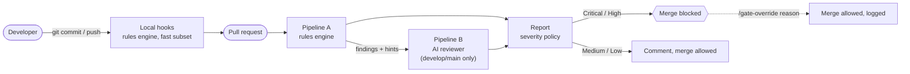

# Quality gate pipelines

How the two review pipelines work, what they cost and how we keep that cost down. Team rules are in [AGENTS.md](../AGENTS.md); design decisions in [DECISIONS.md](../DECISIONS.md); measured accuracy in [EVAL.md](../EVAL.md).

## Executive summary

**What it is.** Every pull request is reviewed automatically before a human sees it, against the team's rules, with extra rigor on children's privacy (GDPR-K, COPPA). Two pipelines work together:

- **Rules engine (deterministic).** Fast, free, exact. Catches leaked secrets, personal data written to logs or sent out, missing data-retention periods, untested code. Runs on every PR and on each developer's laptop before commit.
- **AI reviewer (Gemini).** Catches what rules can't: personal data hidden behind renamed variables, data collected "just in case", business-logic bugs, tests that can't fail. Runs on PRs into `develop` and `main`.

**What it decides.** Critical and High problems block the merge; Medium and Low leave a comment. A production approver can override a block, and every override is recorded on the PR.

**How well it works.** On the 8 reference PRs the gate makes the right merge call on all 8 (no false blocks, no missed blocks). Per finding: precision 1.00, recall 0.94 (17 of 18). The one miss is minors' records handed to analytics. Neither pipeline gets there alone. Details: [EVAL.md](../EVAL.md).

**What it costs.**

| | Per AI review | 1,000 AI reviews / month |
|---|---|---|
| Rules engine | $0 (CI minutes; free on a public repo) | $0 |
| AI reviewer, today's prices (measured) | $0.0027–$0.0041, avg ≈ $0.0035 | ≈ $3.50 |
| AI reviewer, after Jan 1, 2027 (prices double) | ≈ $0.007 | ≈ $7 |
| Re-run of an unchanged PR | $0 (served from cache) | — |

Measured on the 8 reference PRs (2026-10-07): 3.5k–4.3k input tokens, 5–331 output tokens, 0 thinking tokens, ≈ 6 s per review. Every gate run logs its full cost (AI + CI minutes) on the PR; a real PR in CI (#10) cost $0.0041 of AI and 4 runner-minutes. For a team of 5 developers opening 2 PRs each per day, the gate costs ≈ $6/month in Gemini (CI minutes are free on this public repo; ≈ $19/month at list price if it were private); details in [PIPELINE_README.md](../PIPELINE_README.md#cost).

**Recommendation.** Keep `gemini-3.8-flash`: it is Google's newest Flash model and the cost is negligible next to the cost of shipping one privacy incident involving minors. Before prices double in January 2027, run the existing evaluation against the cheaper `gemini-3.5-flash-lite`; switch only if it finds the same Critical problems.

## How a pull request flows

## Pipeline A — rules engine (deterministic)

| | |
|---|---|
| **Runs** | Every PR (job `deterministic`, plus `smoke`), and locally: pre-commit (fast checks on staged files, < 10 s) and pre-push (tests + coverage). |
| **Cost** | No API spend. ~1–3 CI minutes per PR. |
| **Code** | `gate/deterministic/`, one module per rule family; `runner.py` treats a crashing check as a blocking gate error. |

What it checks (rule numbers link the behavior to [AGENTS.md](../AGENTS.md)):

| Area | Checks | Rules | Severity |
|---|---|---|---|
| Personal data | Field registry in sync; personal fields reaching logs, API responses, error messages or outbound calls, including through helper functions and whole-object serialization; copies into stored collections | #1, #2, #3 | Critical |
| Retention | Minors' retention ≤ 90 days; new datasets declare a retention category | #3 | Critical / High |
| Secrets | API keys, tokens, `.env`/key files in the diff and in every commit of the PR | #8 | Critical |
| Input & errors | Route handlers taking raw `dict`; bare/broad/silent `except` | #5 | High |
| Tests | Suite passes; service code changed without tests; < 85% coverage of changed lines | #6 | High |
| Hygiene | Unused code, unreachable code, TODO without ticket, formatting | #7 | Medium / Low |
| Third-party channels | A module that names a vendor (SendGrid, Segment, Zendesk...) and handles a personal field, with no `Legal basis:` in the PR | #2 | High |
| Reviewer integrity | Text in the PR aimed at the AI reviewer (prompt injection) | #15 | High |
| Process | Docs updated with code; decision records exist; the gate workflow not weakened; README works on a clean machine | #20, #18, #15, #16 | Medium / Low / High / Medium (docs and records never block) |

It also emits **hints** (never posted) for the AI: identifiers that may hold personal data, new outbound channels.

## Pipeline B — AI reviewer (Gemini)

| | |
|---|---|
| **Runs** | PRs into `develop` and `main` (job `ai`), after Pipeline A, even if A failed. |
| **Model** | `gemini-3.8-flash`, LOW thinking, temperature 0, JSON-only output; falls back to 3.7/3.6 Flash (same price) on quota or congestion. |
| **Code** | `gate/ai/`: prompt builder, client, validation, pricing, cache. |
| **Safety** | Runs the gate's own instructions from the base branch; treats PR code and text as untrusted data; never executes PR code; the API key lives only in this job. Findings pointing outside the diff are discarded. A failed or truncated review blocks instead of passing silently. |

What it judges: renamed or derived personal data (#1), minors' data leaving the service and whether the PR documents a legal basis (#2), copies without purpose or retention (#3), data minimization (#4), business-level input validation (#5), whether tests can actually fail (#6), logic bugs and style (#9), docs that don't match the code (#20), rules duplicated outside AGENTS.md (#21).

### Cost optimization

The bill has two parts: **input** (what we send: instructions + the PR) and **output** (what the model writes, including its reasoning), which costs **5× more per token**. The levers below are ordered by impact.

| Lever | What it does | Effect | Status |
|---|---|---|---|
| **Result cache** | A review is stored under a fingerprint of everything that shapes it (code changes, PR text, instructions, model settings). Same fingerprint → reuse, no API call. Any change → fresh review. | Re-runs of unchanged PRs cost **$0** | Done |
| **Output cap & terse format** | Max 2,048 output tokens (was 8,192), at most 2-sentence messages, ≤ 6-line code suggestions, at most two style notes. If a review hits the cap it's retried with the cap doubled, up to 4× (8,192); only then does it fail loudly, never a half-done pass. | Bounds the expensive half of the bill; worst case per review drops ~4× | Done; cap adjustable (`GEMINI_MAX_OUTPUT_TOKENS`) once real reviews are measured |
| **Prompt caching** | The instructions are byte-identical for every PR and sent first, followed by slow-changing repository context, so Google can bill that prefix at **10% of the input price**. | Up to ~70% off input in theory | Done, but **not observed**: 0 cached tokens in all measured runs (our prompt is likely below Google's implicit-cache minimum). Explicit caching not worth it at this volume. |
| **Smaller instructions** | Only the rules the AI judges are sent (scripts handle the rest). | Instructions 21% smaller (≈ 3.1k → ≈ 2.4k tokens) | Done |
| **Large PRs** | Files over 300 lines are sent as the changed parts ± 30 lines; generated files (eval results, lockfiles) are never sent; files are packed into requests of at most 30k input tokens (`GEMINI_MAX_INPUT_TOKENS`), each with its own output cap. | Cost grows with the PR instead of one oversized call that truncates. Measured in CI: the 167-file gate PR → 7 requests, 183k input tokens, 39 s, $0.14 | Done |
| **Scope** | The AI runs only on PRs into `develop`/`main`; feature-to-feature PRs get the free rules engine. | Fewer calls | Done |
| **Low reasoning effort** | LOW thinking: reasoning tokens bill at the output price. | Avoids the largest hidden cost | Done |
| **Cheaper model** | `gemini-3.5-flash-lite` costs ~⅕ of the input and ~⅓ of the output price from 2027. | Up to ~65% lower | To evaluate with the golden set before Jan 2027 |
| **Batch / Flex tiers** | 50% off for work that can wait. | Halves evaluation runs | Not for PR reviews (developers wait); candidate for nightly eval |

**KPIs to watch** (printed in every PR's gate summary and in `EVAL.md`): cost per review, cached-token share, cache hit rate on re-runs, reviews hitting the output cap, and precision/recall per severity.

### Model outlook

| Model | Price per 1M tokens (input / output) | Notes |
|---|---|---|
| `gemini-3.8-flash` (current) | $0.75 / $3.75 until Dec 31, 2026; $1.50 / $7.50 after | Newest Flash, generally available since Sep 2, 2026 |
| `gemini-3.7-flash`, `gemini-3.6-flash` | Same as 3.8 | Fallbacks only |
| `gemini-3.5-flash-lite` | $0.30 / $2.50 | Candidate for a cheaper tier; needs the evaluation |
| `gemini-3.1-flash-lite` | $0.25 / $1.50 | Shuts down May 7, 2027: not worth migrating to |
| `gemini-3.5-flash` | $1.50 / $9.00 | More expensive and older: never in the fallback chain |

Source: [Gemini API pricing](https://ai.google.dev/gemini-api/docs/pricing) and [deprecations](https://ai.google.dev/gemini-api/docs/deprecations), checked 2026-10-07. Rates are also encoded in `gate/ai/pricing.py`.

## Severity and blocking

| Severity | PR effect | Required check |
|---|---|---|
| Critical | Job fails with annotations, inline comment with the fix, merge blocked | `quality-gate/<base>/critical` |
| High | Request-changes review, merge blocked | `quality-gate/<base>/high` |
| Medium / Low | Comment, merge allowed | — |
| High on a line the PR only moved (#5, #7, #9) | Demoted to Medium: comment | — |

`GATE_MODE=shadow` (default) only comments; `enforce` blocks. Switch to `enforce` once [EVAL.md](../EVAL.md) validates the gate. Override: a repo `admin`/`maintain` (or a member of `GATE_OVERRIDE_TEAM`) comments `/gate-override <reason>`; it applies to that commit and is recorded on the PR.

## Configuration

| Name | Kind | Default | Purpose |
|---|---|---|---|
| `GEMINI_API_KEY` | secret | — | Gemini access (AI job only) |
| `GEMINI_MODEL` | variable | `gemini-3.8-flash` | Primary model |
| `GEMINI_THINKING_LEVEL` | variable | `LOW` | Reasoning effort |
| `GEMINI_FALLBACK_MODELS` | variable | 3.8, 3.7, 3.6 Flash | Fallback chain (keep same-price models) |
| `GEMINI_MAX_OUTPUT_TOKENS` | variable | `2048` | Output cap per request; a truncated review is retried at 2× and 4× before failing |
| `GEMINI_MAX_INPUT_TOKENS` | variable | `30000` | Input budget per request; larger PRs are split |
| `GATE_ACTIONS_USD_PER_MINUTE` | variable | `0.006` | Runner rate for the per-run cost line |
| `GATE_MODE` | variable | `shadow` | `shadow` comments only, `enforce` blocks |
| `GATE_OVERRIDE_TEAM` / `GATE_ORG_TOKEN` | variable / secret | — | Restrict overrides to a team |
